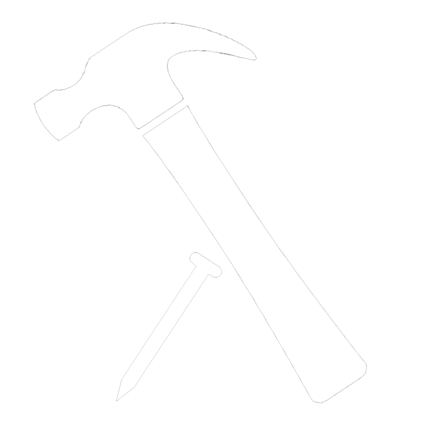

# wacket



## Quickstart

1. Write some wacket (for example, into `example.rkt`)
2. `make example.wat` (optional)
3. `make example.wasm`
4. Open `public/index.html` in a local webserver [TODO: make instructions or something for this]
5. Open the webserver in a browser
6. Click run

## Target Language: WebAssembly

We need to write to `.wat` which is the WebAssembly Text format. From there we can use wat2wasm to turn that into the actual assembly code which can run in the browser.

- WebAssembly Text Format (.wat)
  - find the ast for our representation at the bottom of the readme
  - wat boolean representation
    - true: 1
    - false: 0
  - [Understanding WebAssembly text format](https://developer.mozilla.org/en-US/docs/WebAssembly/Understanding_the_text_format)
  - [Info on Text Format from the WebAssembly GitHub repo](https://webassembly.github.io/spec/core/text/index.html) (this gets _very_ spec-y)
  - [WebAssembly Spec PDF](https://www.google.com/url?sa=t&rct=j&q=&esrc=s&source=web&cd=&ved=2ahUKEwj24szLpob3AhX2l3IEHQHADgEQFnoECAcQAQ&url=https%3A%2F%2Fwebassembly.github.io%2Fspec%2Fcore%2F_download%2FWebAssembly.pdf&usg=AOvVaw008spp5_YkxtS0xQ5c3xJw)
  - [wat s-expression-syntax](https://github.com/WebAssembly/spec/blob/master/interpreter/README.md#s-expression-syntax)
  - [wat examples](https://github.com/mdn/webassembly-examples)

- Compiling from WebAssembly Text format (.wat) to WebAssembly Binary format (.wasm)
  - [Info](https://developer.mozilla.org/en-US/docs/WebAssembly/Text_format_to_wasm)
  - [WABT: The WebAssembly Binary Toolkit](https://github.com/webassembly/wabt)
  - Think of this as our version of nasm
  - can install from a package manager (e.g. `sudo apt install wabt`)

## The Runtime system

Our runtime system is written in JavaScript, which can interface with compiled WASM bidirectionally.
There is a minimal HTML file to act as an interface to the runtime system.
This must be exposed to localhost with a web server, because modern browsers don't allow for accessing arbitrary files in the filesystem.

## Source Language: Racket (Loot)

We'll be aiming to implement all the features present in Loot, the reduced version of Racket created in class already.
This should allow for the re-use of much of the compiler infrastructure, like the lexer, parser, and AST.

[class github repo](https://github.com/cmsc430)

## TODO

- start working on functionality

## wat AST

Note: [list of Things] may be empty in this representation.

```
type Module = (Module [list of Definitions])

type Definition = Import
                | Export
                | Func
                | Start

type Start = (Start funcname)

;; imports have a 2 level namespace: module then function
type Import = (Import modulename funcname FuncSignature)

;; name is what the RTS will see, ExportFuncSignature is what we use internally
type Export = (Export name ExportFuncSignature)

type ExportFuncSignature = (ExportFuncSignature name)

type Func = (Func FuncSignature [list of Locals] Body)

type FuncSignature = (FuncSignature name? [list of Params] Result?)

type Param = (Param name? Type)

type Result = (Result Type)

type Local = (Local name? Type)

type Type = i32
          | i64
          | f32
          | f64

type Body = (Body [list of Instructions])

type Instruction = (Inst name [list of Instructions])
                 | Const

type Const = (Const v)

```
